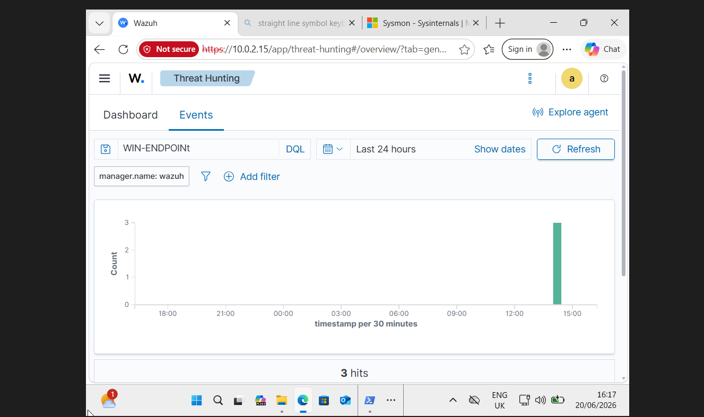
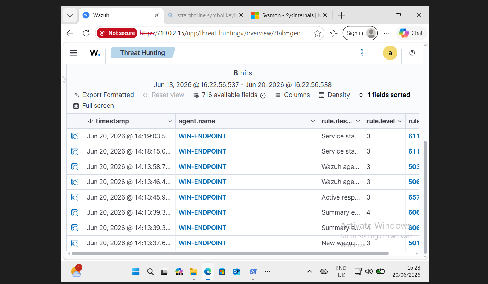
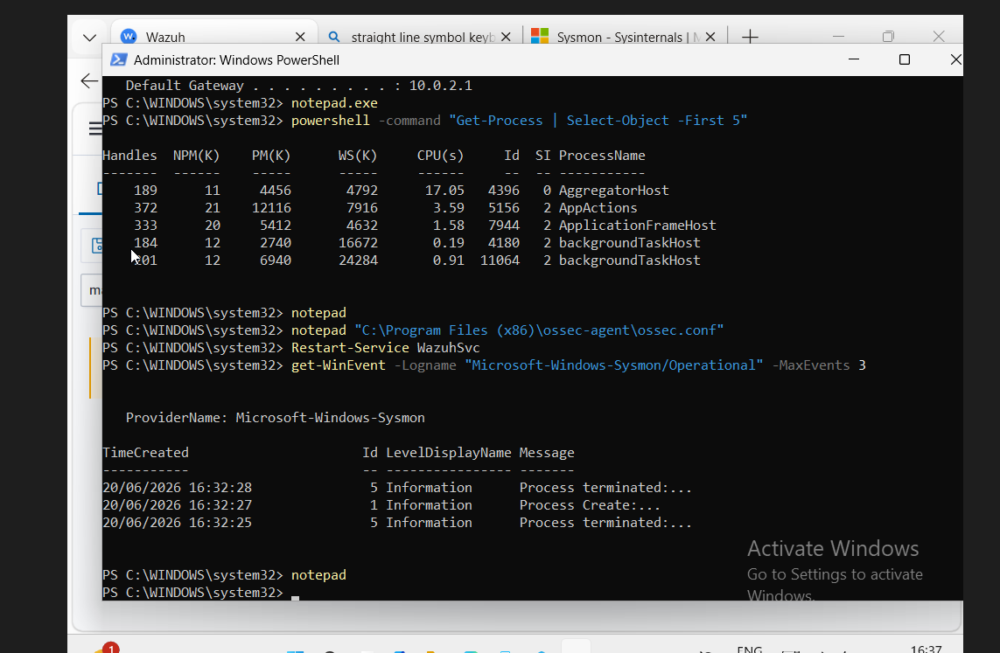
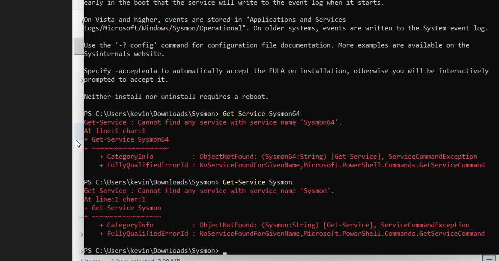
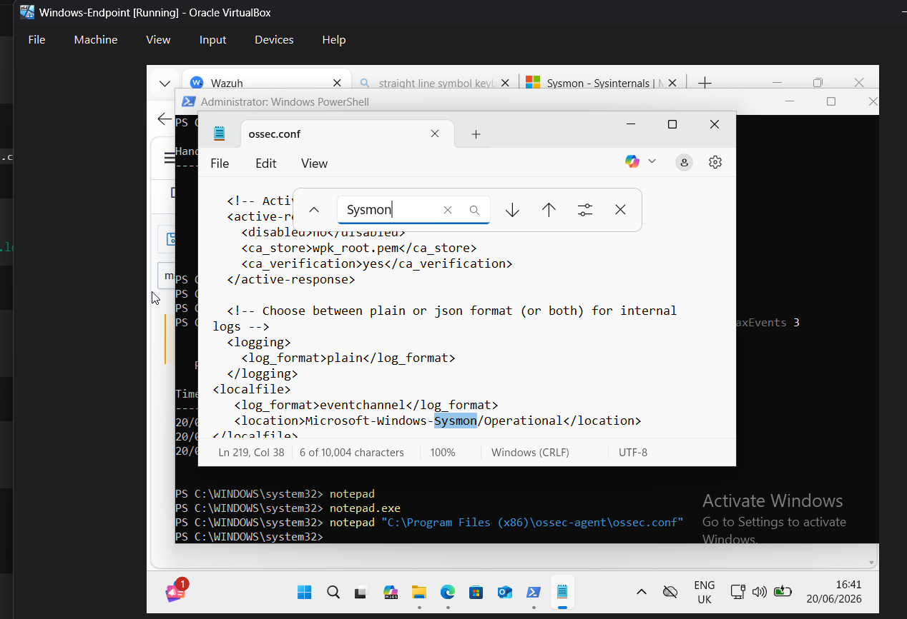
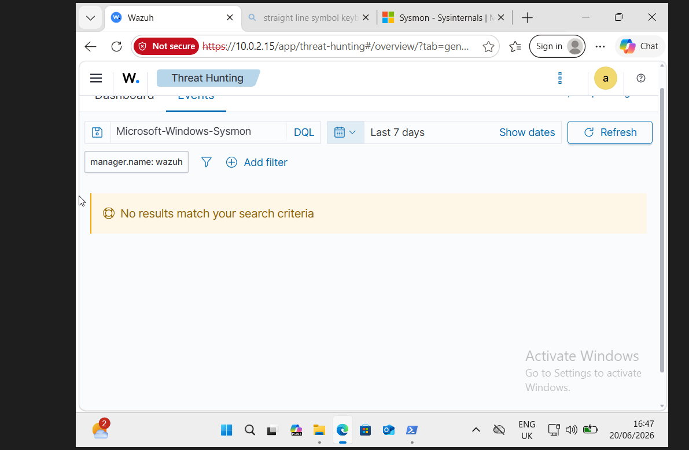
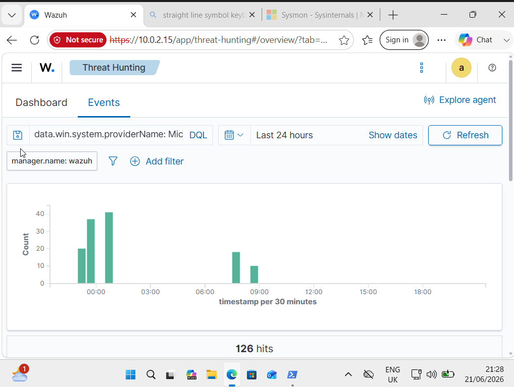
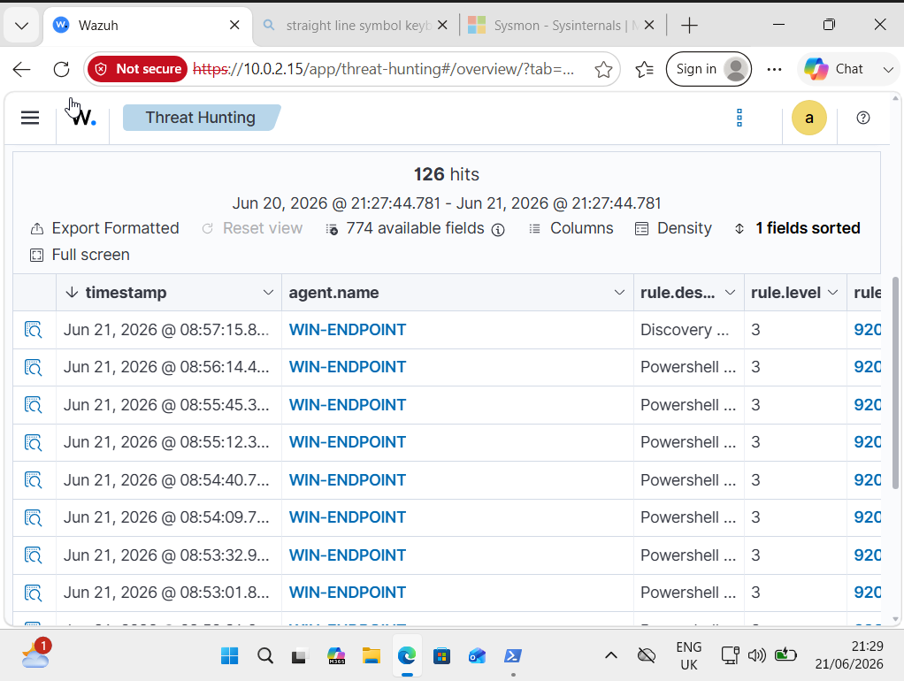

# Wazuh SIEM Home Lab: Endpoint Monitoring & Telemetry Ingestion

## 📌 Project Overview
This project documents the end-to-end deployment of an enterprise-grade blue-team home lab using **Wazuh SIEM** inside Oracle VirtualBox. The objective of this project was to establish a central security monitoring framework, onboard a Windows target endpoint, enrich local logging via Microsoft Sysmon, and validate live log ingestion and parsing within the threat hunting dashboard.

---

## 💻 Lab Environment & Architecture

| Component | Technical Details |
| :--- | :--- |
| **Host System** | Windows 11 |
| **Hypervisor** | Oracle VirtualBox |
| **SIEM Platform** | Wazuh 4.14.5 Stack (Manager, Indexer, Dashboard, Filebeat) |
| **SIEM Server OS** | Ubuntu Server 24.04 LTS |
| **Target Endpoint** | Windows 11 Pro Enterprise Sandbox (`WIN-ENDPOINT`) |
| **Network Layout** | VirtualBox Isolated Subnet with Host Port Forwarding |

---

## 🛠️ Implementation Milestones

### Phase 1: SIEM Core Infrastructure Deployed
* **OS Provisioning:** Built an optimized instance running Ubuntu Server 24.04 LTS.
* **Stack Automated Setup:** Configured the core Wazuh manager component architecture using the automated installation assistant.

### Phase 2: Windows Endpoint Onboarding & Subnet Realignment
* **Agent Setup:** Installed the native Wazuh Windows agent and verified its persistent background state (`WazuhSvc`).
* **Subnet Mapping:** Handled cross-VM network isolation hurdles to guarantee reliable host-to-guest and guest-to-guest communication channels, updating the endpoint status to active.

### Phase 3: High-Fidelity Logging via Microsoft Sysmon ✅
* **Telemetry Collection:** Deployed Microsoft Sysmon on the endpoint to acquire deep system execution context (Process creation, network handshakes).
* **Agent Integration:** Injected precise configuration parameters into the endpoint's `ossec.conf` file to ingest operational telemetry directly into the SIEM database.
* **Ingestion Success:** Successfully verified over 126 parsed event hits directly inside the main console workspace.

---

## 🔍 Engineering & Troubleshooting Log

### 1. Operating System Compatibility Adjustments
* **Issue:** The initial deployment utilized Ubuntu 26.04, triggering severe compatibility flags and package architecture compilation drops during stack installation.
* **Resolution:** Re-provisioned the hypervisor space using **Ubuntu Server 24.04 LTS**, aligning completely with the stable production validation path.

### 2. Overcoming Restrictive Storage Bounds (LVM)
* **Issue:** Default LVM storage parameters bounded the root filesystem (`/`) to an arbitrary ~24 GB layout despite provisioned virtual disk sizing. The storage-intensive indexer failed validation loops immediately.
* **Resolution:** Adjusted partition variables during OS installation to unlock a flat **68 GB** of unconstrained storage directly available on the root path.

### 3. "No Bootable Medium Found" VirtualBox Lock
* **Issue:** Target virtual instances failed setup loops, throwing physical boot device attachment errors.
* **Resolution:** Opened VM Settings ➡️ Storage, and manually mapped the official Microsoft assessment ISO directly to the virtual optical IDE/SATA controllers.

### 4. Resolving Network Isolation & APIPA IP Address Loop
* **Issue:** The target Windows machine initially loaded with an unroutable APIPA address, rendering it completely blind to the Wazuh Manager sitting at `10.0.2.15`. 
* **Resolution:** Configured unified VirtualBox Network assignments matching both host nodes. The Windows endpoint successfully acquired a valid lease at `10.0.2.12`, establishing clean data communication routes inside the internal subnet workspace.

### 5. PowerShell `CommandNotFoundException` on Sysmon Deployment
* **Issue:** Invoking the installation script via standard administrative prompts returned execution exceptions due to systemic pathing errors.
* **Resolution:** Explicitly modified active directory parameters to point directly to the user-space destination download folder (`C:\Users\kevin\Downloads\Sysmon`) before establishing execution parameters.

### 6. Verification of the Local Sysmon Engine Name
* **Issue:** Running `Get-Service Sysmon64` or `Get-Service Sysmon` initially failed with an `ObjectNotFoundException`, raising concerns about whether the engine was loaded properly.
* **Resolution:** Confirmed the execution by directly querying the local Windows Event Log provider using `Get-WinEvent -Logname "Microsoft-Windows-Sysmon/Operational" -MaxEvents 3`. The prompt returned clear, live event data (Event ID 1: Process Creation; Event ID 5: Process Termination).

### 7. Pipeline Delay Handling (No Results Match Search Criteria)
* **Issue:** Even though Sysmon logs were actively printing to the local Event Viewer engine, adding parameters to the agent's `ossec.conf` configuration profile did not immediately display data within the centralized SIEM interface.
* **Resolution:** Executed administrative `Restart-Service WazuhSvc` triggers to force immediate runtime reloads. Once configuration blocks successfully bound to the agent, the event processing pipelines stabilized completely.

---

## 📸 Technical Artifacts & Evidence

### Milestone 1: Windows Endpoint Onboarding
Validation that network adjustments stabilized routing paths across the environment to pull core asset inventory:

* **Active Agent Onboarding Confirmation:**
  
* **Wazuh Agent Event Logs:**
  

### Milestone 2: Sysmon Local Verification & Troubleshooting
Tracking down local execution parameters before updating configuration profiles:

* **Sysmon Local Verification and Agent Management:**
  
* **Sysmon Path/Service Discovery Error:**
  

### Milestone 3: Telemetry Collection & Parsing Success
Evidence of targeted local log capture profiles properly forwarding logs to the SIEM stack:

* **Wazuh Configuration Block Injected (`ossec.conf`):**
  
* **Initial Empty Pipeline State (Pre-Service Restart):**
  
* **Live Telemetry Stream Active (126 Hits Verified):**
  
* **Parsed Telemetry View (PowerShell Events Loaded):**
  

The ingestion panel successfully captures events via the `data.win.system.providerName` field tracking live PowerShell sessions and internal administrative changes.

---

## 🚀 Future Milestones
1. **Log Filtering Optimization:** Deploy structured rule sets (e.g., SwiftOnSecurity profile mappings) to filter noisy administrative alerts.
2. **Custom Detection Rules:** Write tailored manager-side XML signatures to flag anomalous activity like lateral network reconnaissance.
3. **Attack Emulation Playbooks:** Run controlled adversary test routines (e.g., Atomic Red Team modules) to document practical alert matching rules.
