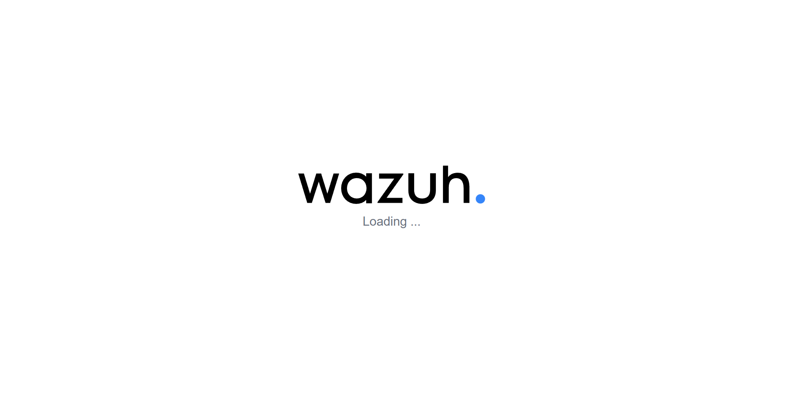
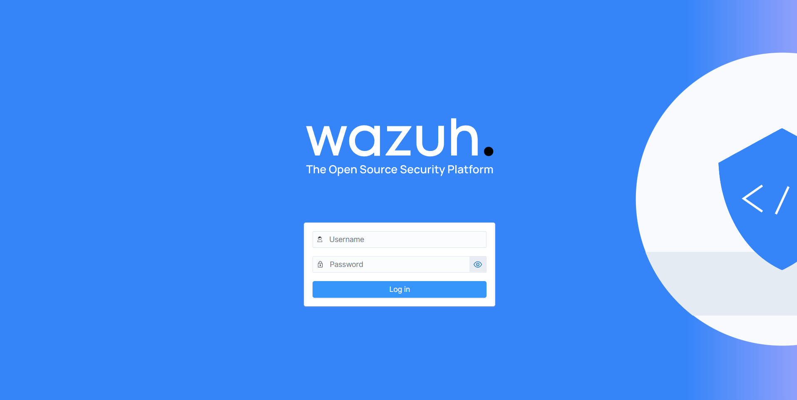
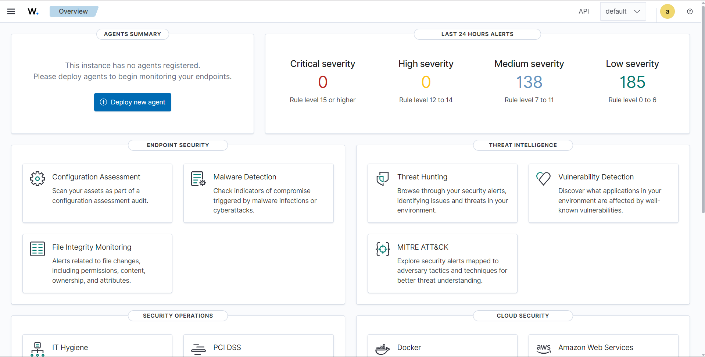
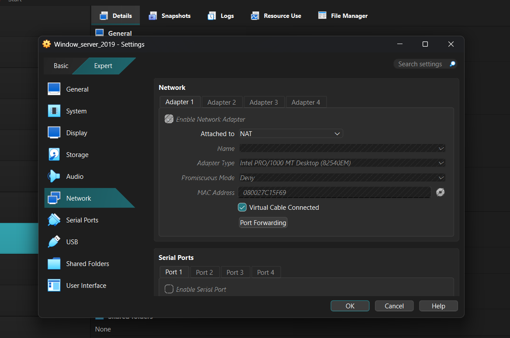

# Wazuh SIEM Home Lab

## Overview

This project documents the setup of a beginner-friendly blue-team home lab using Wazuh SIEM on Ubuntu Server inside Oracle VirtualBox.

The goal was to build a working SIEM foundation for SOC analyst practice, endpoint monitoring, alert review, and future detection engineering exercises.

## Lab Environment

| Component | Details |
| --- | --- |
| Host OS | Windows 11 |
| Hypervisor | Oracle VirtualBox |
| SIEM | Wazuh 4.14.x |
| Server OS | Ubuntu Server 24.04 LTS |
| VM Memory | Around 6 GB |
| VM CPU | 3 cores |
| VM Disk | Rebuilt with larger root partition after LVM sizing issue |
| Dashboard Access | Browser access through VirtualBox NAT port forwarding |

## What I Built

- Installed Ubuntu Server 24.04 LTS in VirtualBox.
- Configured VM resources for Wazuh.
- Installed Wazuh Manager, Indexer, Filebeat, and Dashboard using the Wazuh installation assistant.
- Rebuilt the VM after discovering the first install only allocated around 24 GB to `/`.
- Confirmed the improved setup had around 68 GB available.
- Used VirtualBox port forwarding to access the Wazuh dashboard from the Windows host.
- Logged into the Wazuh dashboard and verified the overview screen loaded.

## Troubleshooting Notes

### Issue 1: Unsupported Ubuntu Version

The first attempt used Ubuntu 26.04, which caused Wazuh compatibility warnings. The fix was to reinstall with Ubuntu Server 24.04 LTS.

### Issue 2: Root Partition Too Small

The first Ubuntu install used LVM and allocated only about 24 GB to `/`, even though the virtual disk was larger. Wazuh Dashboard installation failed because the system did not have enough usable root space.

Fix:

- Reinstalled Ubuntu.
- Used a larger dynamically allocated virtual disk.
- Avoided the LVM layout for the beginner lab.
- Confirmed available disk space before reinstalling Wazuh.

### Issue 3: Accessing Dashboard from Windows

The Wazuh server used VirtualBox NAT networking. The fix was to use host port forwarding:

| Host | Guest |
| --- | --- |
| `127.0.0.1:8443` | `10.0.2.15:443` |

After this, the dashboard was reachable from the Windows browser at:

```text
https://127.0.0.1:8443
```

## Evidence Captured

### Wazuh Loading Screen



### Wazuh Login Page



### Wazuh Overview Dashboard



### VirtualBox Network Review

This screenshot documents the Windows Server VM network review while preparing for future Wazuh agent deployment.



## Security Note

Administrative credentials and password files are intentionally excluded from this repository. Screenshots should be reviewed and redacted before public sharing.

## Next Steps

- Add a Windows Server 2019 endpoint as a Wazuh agent.
- Install Sysmon on the Windows endpoint.
- Collect Windows Security logs and Sysmon telemetry.
- Simulate safe events such as failed logins and PowerShell execution.
- Create detection notes and incident-style writeups.

## Skills Demonstrated

- Linux server administration
- VirtualBox VM setup
- SIEM deployment
- Basic networking and port forwarding
- Troubleshooting installation failures
- Security lab documentation
